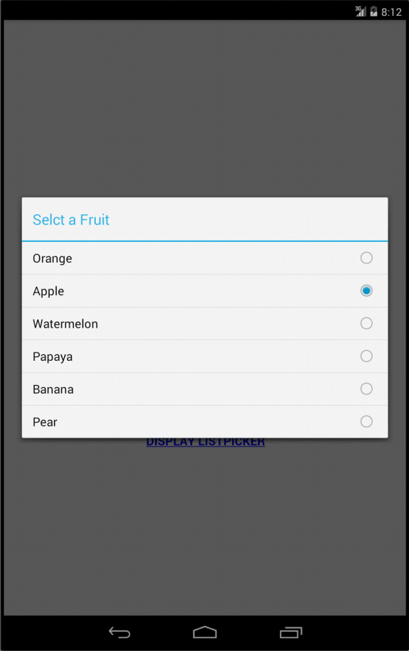
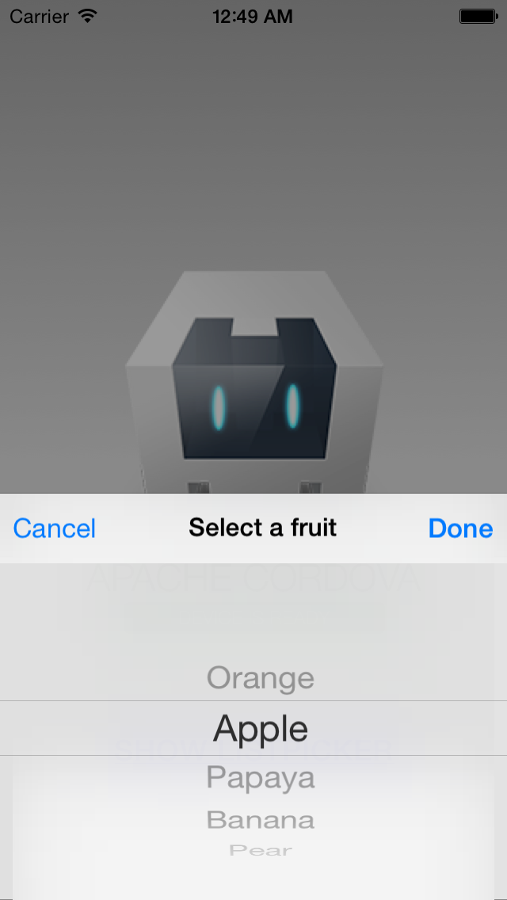
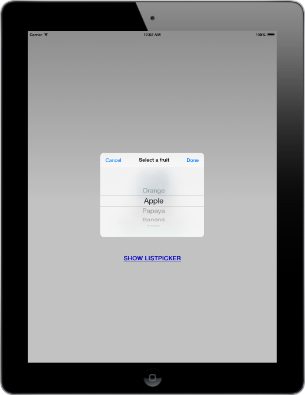

ListPicker
=============

PhoneGap plugin to display a list picker dialog for Android and iOS.

## Installation

Use the following command to install the plugin from npmjs repository with with Cordova CLI (requires cordova 5.0+)
```cordova plugin add cordova-plugin-listpicker```  

## Installation - PhoneGap Build 

Add the following line to config.xml: 
```<gap:plugin name="cordova-plugin-listpicker" source="npm" />```

## Usage

    // Prepare the picker configuration
    var config = {
        title: "Select a Fruit", 
        items: [
            { text: "Orange", value: "orange" },
            { text: "Apple", value: "apple" },
            { text: "Watermelon", value: "watermelon" },
            { text: "Papaya", value: "papaya" },
            { text: "Banana", value: "banana" },
            { text: "Pear", value: "pear" }         
        ],
        selectedValue: "papaya",
        doneButtonLabel: "Done",
        cancelButtonLabel: "Cancel"
    };
    
    // Show the picker
    window.plugins.listpicker.showPicker(config, 
        function(item) { 
            alert("You have selected " + item);
        },
        function() { 
            alert("You have cancelled");
        }
    );

## Screenshots





## Licence

    The MIT License

    Copyright (c) 2014 Robert Hovhannisyan

    Permission is hereby granted, free of charge, to any person obtaining a copy
    of this software and associated documentation files (the "Software"), to deal
    in the Software without restriction, including without limitation the rights
    to use, copy, modify, merge, publish, distribute, sublicense, and/or sell
    copies of the Software, and to permit persons to whom the Software is
    furnished to do so, subject to the following conditions:

    The above copyright notice and this permission notice shall be included in
    all copies or substantial portions of the Software.

    THE SOFTWARE IS PROVIDED "AS IS", WITHOUT WARRANTY OF ANY KIND, EXPRESS OR
    IMPLIED, INCLUDING BUT NOT LIMITED TO THE WARRANTIES OF MERCHANTABILITY,
    FITNESS FOR A PARTICULAR PURPOSE AND NONINFRINGEMENT. IN NO EVENT SHALL THE
    AUTHORS OR COPYRIGHT HOLDERS BE LIABLE FOR ANY CLAIM, DAMAGES OR OTHER
    LIABILITY, WHETHER IN AN ACTION OF CONTRACT, TORT OR OTHERWISE, ARISING FROM,
    OUT OF OR IN CONNECTION WITH THE SOFTWARE OR THE USE OR OTHER DEALINGS IN
    THE SOFTWARE.

Credits:

* iOS part inspired by 
  
  [TimCinel](https://github.com/TimCinel/ActionSheetPicker) 
  [mgcrea](https://github.com/mgcrea/cordova-pickerview)
  [skywinder] (https://github.com/skywinder/ActionSheetPicker-3.0)
